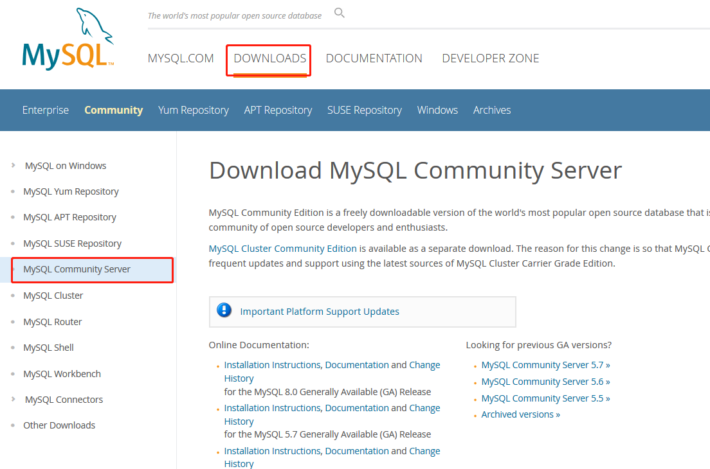
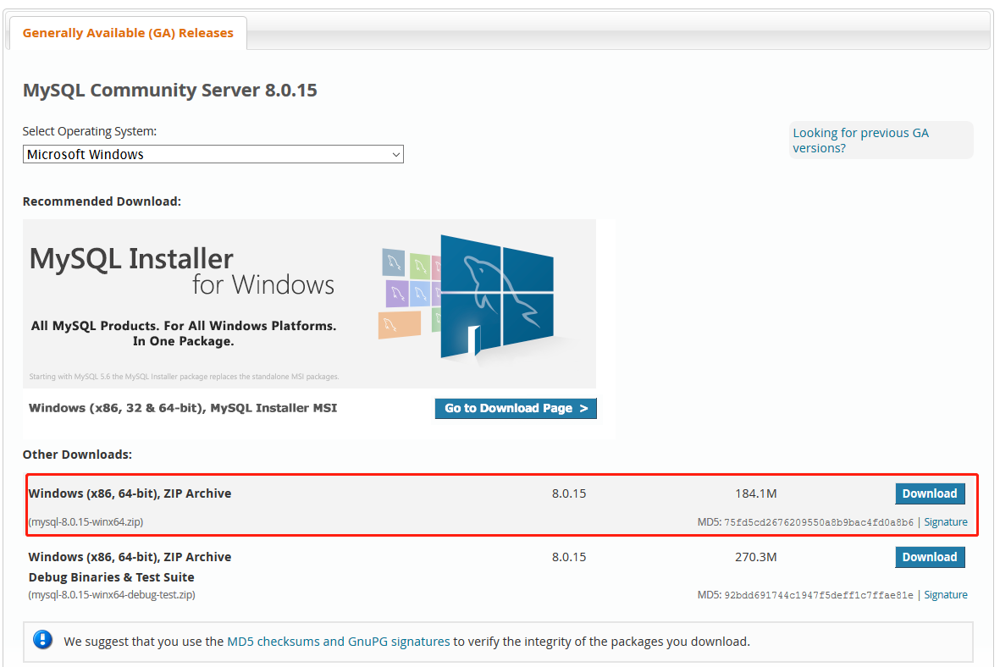
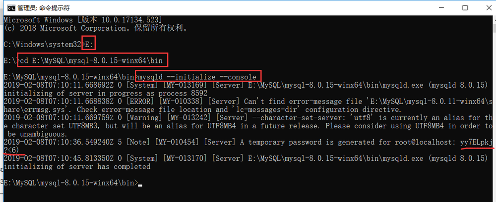
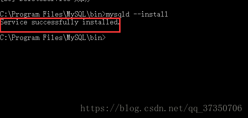
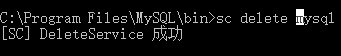
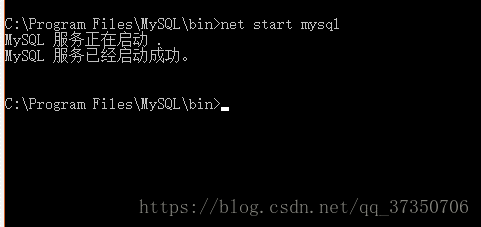
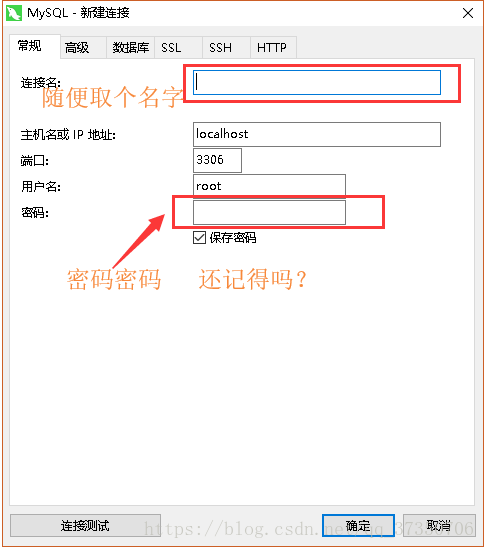

## 一、    下载





 

## 二、    安装

### 1.       创建配置文件

```ini
[mysqld]
# 设置3306端口
port=3306

# 自定义设置mysql的安装目录，即解压mysql压缩包的目录
basedir=E:\MySQL\mysql-8.0.11-winx64

# 自定义设置mysql数据库的数据存放目录
datadir=E:\MySQL\mysqlDate

# 允许最大连接数
max_connections=200

# 允许连接失败的次数，这是为了防止有人从该主机试图攻击数据库系统
max_connect_errors=10

# 服务端使用的字符集默认为UTF8
character-set-server=utf8

# 创建新表时将使用的默认存储引擎
default-storage-engine=INNODB

# 默认使用“mysql_native_password”插件认证
default_authentication_plugin=mysql_native_password

[mysql]
# 设置mysql客户端默认字符集
default-character-set=utf8

[client]
# 设置mysql客户端连接服务端时默认使用的端口和默认字符集
port=3306
default-character-set=utf8

```

下载完压缩包之后就解压，再创建一个同级空目录mysqlData，再进入mysql8.0.15安装根目录创建一个my.ini配置文件。

 

### 2.       初始化数据库

进入安装目录的bin目录，初始化数据库，输入命令**mysqld --initialize --console**回车。

使用cmd切换到mysql安装根目录下的bin目录，切记要用管理员身份运行。切换指定路径的方法也在截图中。



​     其中root@localhost:后面的一串yy7ELpkj?<6)   就是初始密码（不含首位空格），在没有更改密码前，需要记住这个密码，复制保存，后续登录需要用到！

### 3.       注册服务

执行命令：**mysqld --install [****服务名]** （服务名可以不加，默认为mysql）



若服务已存在，可执行：**sc delete [****服务名]** 删除



### 4.       启动服务

使用命令 **net start [****服务名]** 启动服务



## 三、    登录

下载Navicat工具，连接并登录MySql



