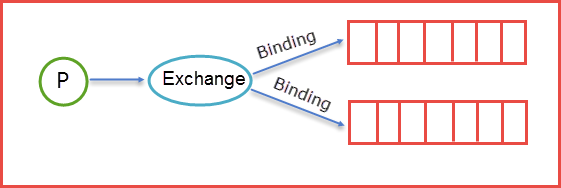

# 一、背景

RabbitMQ是一个由erlang开发的AMQP（Advanced Message Queue ）的开源实现。AMQP 的出现其实也是应了广大人民群众的需求，虽然在同步消息通讯的世界里有很多公开标准（如 COBAR的 IIOP ，或者是 SOAP 等），但是在异步消息处理中却不是这样，只有大企业有一些商业实现（如微软的 MSMQ ，IBM 的 Websphere MQ 等），因此，在 2006 年的 6 月，Cisco 、Redhat、iMatix 等联合制定了 AMQP 的公开标准。

RabbitMQ的官网：http://www.rabbitmq.com

# 二、基础概念

## 1、队列（Queue）

 Queue（队列）RabbitMQ的作用是**存储消息**，队列的特性是**先进先出**。生产者生产消息最终被送到RabbitMQ的内部对象Queue中去，而消费者则是从Queue队列中取出数据。

可以简化成表示为

生产者Send Message “A”被传送到Queue中，消费者发现消息队列Queue中有订阅的消息，就会将这条消息A读取出来进行一些列的业务操作。这里只是一个消费正对应一个队列Queue，也可以多个消费者订阅同一个队列Queue，当然这里就会将Queue里面的消息平分给其他的消费者，但是会存在一个一个问题就是如果每个消息的处理时间不同，就会导致某些消费者一直在忙碌中，而有的消费者处理完了消息后一直处于空闲状态，因为前面已经提及到了Queue会平分这些消息给相应的消费者。这里我们就可以使用prefetchCount来限制每次发送给消费者消息的个数。

详情见下图所示：

## 2、交换机（Exchange）

### 1）Exchange机制

RabbitMQ是通过Binding将Exchange和Queue链接在一起，这样Exchange就知道如何将消息准确的推送到Queue中去。

在绑定（Binding）Exchange和Queue的同时，一般会指定一个Binding Key，生产者将消息发送给Exchange的时候，一般会产生一个Routing Key，当Routing Key和Binding Key对应上的时候，消息就会发送到对应的Queue中去。

### 2）Exchange Type

| 类型名称 | 类型描述                                                     |
| -------- | ------------------------------------------------------------ |
| fanout   | 把所有发送到该Exchange的消息路由到所有与它绑定的Queue中      |
| direct   | Routing Key==Binding Key                                     |
| topic    | 模糊匹配                                                     |
| headers  | Exchange不依赖于routing key与binding key的匹配规则来路由消息，而是根据发送的消息内容中的headers属性进行匹配。 |

#### a. fanout

把所有发送到该Exchange的消息路由到所有与它绑定的Queue中

#### b. direct

把消息路由到那些binding key与routing key完全匹配的Queue中

#### c. topic

topic是模糊匹配，可以通过通配符满足一部分规则就可以传送。

它的约定是：

1. routing key为一个句点号“. ”分隔的字符串（我们将被句点号“. ”分隔开的每一段独立的字符串称为一个单词），如“stock.usd.nyse”、“nyse.vmw”、“quick.orange.rabbit”
2. binding key与routing key一样也是句点号“. ”分隔的字符串
3. binding key中可以存在两种特殊字符“*”与“#”，用于做模糊匹配，其中“*”用于匹配一个单词，“#”用于匹配多个单词（可以是零个）

