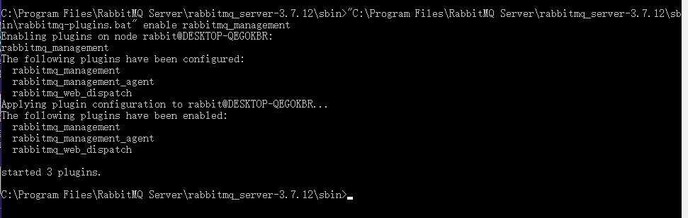
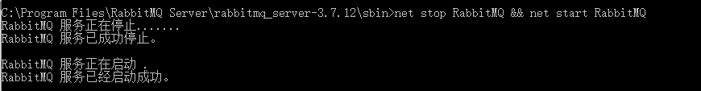
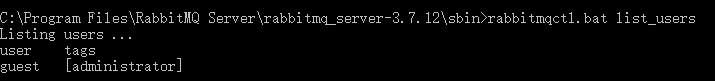

# 一、下载

官网下载

# 二、安装

Next直接安装

# 三、配置

## 1、激活插件

激活 RabbitMQ's Management Plugin

```
"C:\Program Files\RabbitMQ Server\rabbitmq_server-3.6.5\sbin\rabbitmq-plugins.bat" enable rabbitmq_management
```



## 2、重启服务

```
net stop RabbitMQ && net start RabbitMQ
```



## 3、创建用户

使用rabbitmqctl控制台命令（位于C:\Program Files\RabbitMQ Server\rabbitmq_server-3.6.5\sbin>）来创建用户，密码，绑定权限等

- 查看已有用户及用户的角色

    ```
    rabbitmqctl.bat list_users
    ```

    

- 新增一个用户

    ```
    rabbitmqctl.bat add_user username password
    ```

- 删除用户

    ```
    rabbitmqctl.bat delete_user username
    ```

- 修改密码

    ```
    rabbitmqctl change_password userName newPassword
    ```

- **角色分类**

    1. **超级管理员(administrator)**

        可登陆管理控制台(启用management plugin的情况下)，可查看所有的信息，并且可以对用户，策略(policy)进行操作。

    2. **监控者(monitoring)**

        可登陆管理控制台(启用management plugin的情况下)，同时可以查看rabbitmq节点的相关信息(进程数，内存使用情况，磁盘使用情况等) 

    3. **策略制定者(policymaker)**

        可登陆管理控制台(启用management plugin的情况下), 同时可以对policy进行管理。

    4. **普通管理者(management)**

        仅可登陆管理控制台(启用management plugin的情况下)，无法看到节点信息，也无法对策略进行管理。

    5. **其他的**

        

    - 给人员分配角色

        ```
        rabbitmqctl.bat set_user_tags username administrator
        ```

    - 给人员分配多个角色

        ```
        rabbitmqctl.bat  set_user_tags  username tag1 tag2 ...
        ```

## 4、权限配置

- 设置用户权限

    ```
    rabbitmqctl  set_permissions  -p  VHostPath  User  ConfP  WriteP  ReadP
    ```

- 查看(指定hostpath)所有用户的权限信息

    ```
    rabbitmqctl  list_permissions  [-p  VHostPath]
    ```

- 查看指定用户的权限信息

    ```
    rabbitmqctl  list_user_permissions  User
    ```

- 清除用户的权限信息

    ```
    rabbitmqctl  clear_permissions  [-p VHostPath]  User
    ```

    

# 四、Virtual Hosts管理


